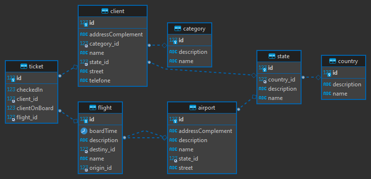

# airport-api Project

API para sistema de compra de passagens de aeroportos.

O cliente pode comprar passagens, embarcar, pedir serviço de bordo.

CRUD para cada uma das tabelas.

> Na pasta **docs** está disponível os diagramas relacionais.

## ER diagram



## Running the application in dev mode

You can run your application in dev mode that enables live coding using:
```shell script
./mvnw compile quarkus:dev
```

## Dependencies
- Java 17